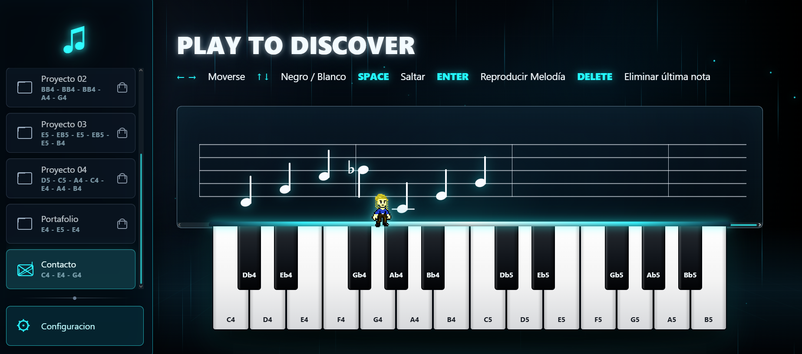
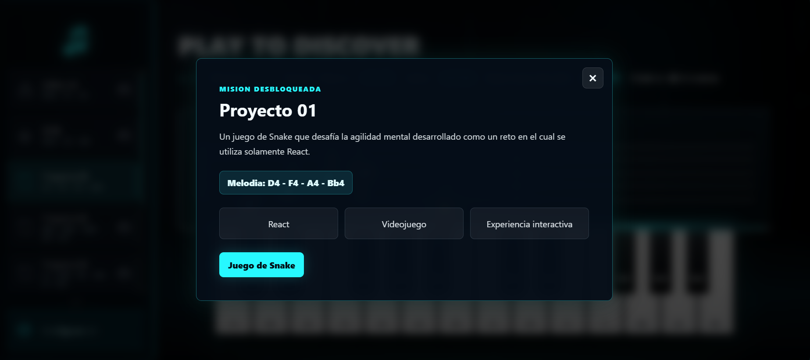
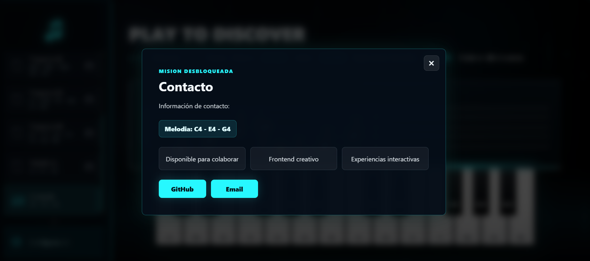

# Interactive Frontend Portfolio

## Demo en Vercel

https://portafolio-web-six-weld.vercel.app 

---

# Instrucciones
Usar mover (usando flechas) el personaje alrededor del piano y saltar (con espacio) tocando las notas para cumplir las misiones y desbloquear las zonas del portafolio.

---

# Acerca de este Portafolio

Este portafolio fue diseñado para demostrar mis habilidades como desarrolladora front end y aprender acerca de nuevas formas de desarrollar, buscando hacer experiencias web interactivas e interfaces modernas.

En vez de crear una experiencia tradicional minimalista, quise enfocar mi portafolio en crear experiencias que reflejen mi conocimiento y mis intereses creativos.

La audiencia para este portafolio incluye:
- Agencias que busquen frontends creativos
- Startups que se enfoquen en UX
- Productos interactivos 
- Compañías interesadas en personas que busquen aprender

---

# Tecnologías utilizadas

## Frontend
- React
- TypeScript
- Vite

## Animación e interacción
- Framer Motion
- Tone.js

## Testing
- Vitest

## Deployment
- Vercel

---

# Features

- Responsive design
- Interactive animations
- Audio-reactive interactions
- Component-based architecture
- Modular project structure
- Automated testing
- Smooth transitions and navigation

---

## Audio Interactive UI
Experimental interface using Tone.js and motion-based interactions.

### What I Learned
- Audio synchronization
- Event-driven animation systems
- UX experimentation

---

# Ejecución

```bash
git clone https://github.com/Tiffany24630/Portafolio-Web.git 
cd portfolio-web
docker compose up --build
```

---

# Reflection

## Audience and Goal

Este portafolio es principalmente enfocado en hacer elementos de front creativos para startups y compañías que busquen ideas interactivas y experiencias de usuario con identidad visual. Mi objetico con este portafolio es lograr que se sienta más como una experiencia que como una página web estática, debido a que considero que un diseño interactivo representa mejor las experiencias que me gusta experimentar como usuario y son en las que considero que puedo aprender más.

---

## Technologias elegidas

Elegí React y TypeScript porque proveen escalabilidad, mantenimiento y herramientas para desarrollo de front. Framer Motion me permitió crear transiciones fluidas y hacer la experiencia más inmersiva, mientras que Tone.js me dió la oportunidad de experimentar con interracciones de audio.

---

## Technologias que decidí no utilizar

Una tecnología que decidí no utilizar fueron las de backend, debido a que es algo en lo que considero que ya practico y aprendo bastante a diario, por lo que decidí enfocarme en aspectos de front end. 

---

## Risks vs Safe Decisions

En general todo el portafolio fue un reto para mi, debido a que decidí específicamente enfocarme en front para aprender más al respecto, ya que es el campo en el que siento que peor me va, además que decidí integrar audio en el portafolio.

---

## Future Improvements

Si tuviera más tiempo para mejorar mi proyecto me enfocaría en:
- Optimización del performance
- Accessibility improvements
- Responsive para movil
- Code splitting
- Mejoras visuales
- Más proyectos incluidos y mejoras en los mismos
- Polished transitions

---

# Screenshots

## Home Page



## Projects Section


# Contact
